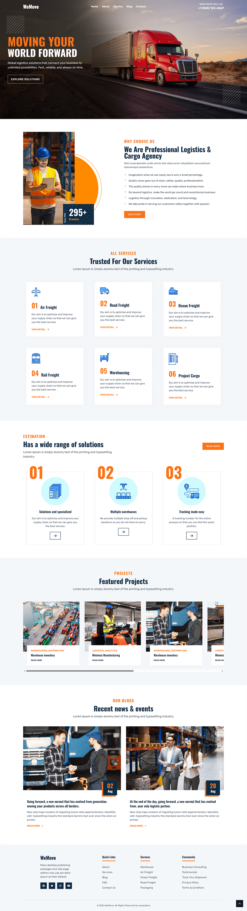

<div>
  <h1>WeMove Transport — Logistics & Cargo Website</h1>

  <p>
    A fully responsive logistics and cargo landing page that works seamlessly on all devices. <br />
    Built with HTML, Tailwind CSS, and a modular JavaScript architecture using separate component files.
  </p>

  <p>
    <strong>Note:</strong> I started building HTML, CSS, and JavaScript projects in 2022. <br />
    At that time, I focused on learning first and began uploading to GitHub recently. <br />
    Now I'm working with React.js and Next.js, and seeking opportunities as a frontend or web developer.
  </p>
</div>

## What's Inside
- `index.html` — main website structure with section root elements
- `assets/js/app.js` — application entry point that initializes all components
- `assets/js/header.js` — navigation menu with mobile drawer and scroll effects
- `assets/js/hero.js` — hero section with animated floating shapes
- `assets/js/about.js` — about section with feature points and imagery
- `assets/js/service.js` — services grid with icon cards
- `assets/js/feature.js` — feature cards with numbered highlights
- `assets/js/project.js` — projects showcase with image gallery
- `assets/js/blog.js` — blog posts section with date badges
- `assets/js/footer.js` — footer with links and social media icons
- `assets/js/backTop.js` — back to top button functionality
- `assets/images/` — hero banners, service icons, project images, shapes, and UI assets

## Technologies Used
HTML5 · Tailwind CSS · Vanilla JavaScript · Google Fonts (Oswald, Rubik) · Ionicons

## Features
- Fully responsive layout optimized for mobile, tablet, and desktop screens
- Modular JavaScript architecture with separate component files
- Smooth mobile navigation drawer with overlay effect
- Dynamic header background that changes on scroll
- Service cards with hover effects and detailed information display
- Featured projects showcase with horizontal scroll functionality

## Quick Start
1. **Clone the repository:**  
   ```bash
   git clone https://github.com/nawazdevx/wemove-transport.git
   ```

2. **Open the project:**  
   - Simply open `index.html` in your browser  
   - Or run a local server:  
     ```bash
     python -m http.server 3000
     ```
     Then visit `http://localhost:3000`

## Customization
- Update content in each JavaScript data object (e.g., `headerData`, `heroData`, `serviceData`)
- Replace images in `assets/images/` folder (maintain the same filenames or update the paths in JS files)
- Customize colors by modifying the Tailwind config object in `index.html` (primary, secondary, accent colors)
- Add or remove sections by editing the component imports in `app.js`

## License
This project is licensed under the [MIT License](https://choosealicense.com/licenses/mit/).

## Contact
If you want to contact me, you can reach me at [LinkedIn](https://www.linkedin.com/in/nawazdevx).

## Support
If you find this project useful, please consider starring it on GitHub ⭐ to show your support!

<br />

<div align="center">
  <h1>Project Preview</h1>
  
  <p>
    You can view the live project here ➜
    <a href="https://nawazdevx.github.io/wemove-transport/" target="_blank"><strong>Live Demo</strong></a>
  </p>

  
</div>